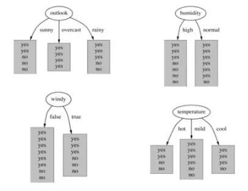

# 本周作业

## 包含文件

- Reference：参考答案和代码（作业第二天上传至 GitHub）

- Submission：学员提交的优秀答案（从所有学员提交的答案中选择最佳答案若干，上传至 GitHub）

## 作业

- 第一节：

  - 1.概括决策树分类算法的原理。
  
  - 2.在构建一个决策树模型时，我们对某个属性分割节点，下面四张图中，哪个属性对应的信息增益最大？
  
  
  - 3.将本章中“使用决策树预测隐形眼镜类型”完整代码键入jupyter notebook，并添加详细注释。若有可能，自己可以优化该代码。

- 第二节：

  - 1.概括朴素贝叶斯分类算法的原理，为什么称之为“朴素”？
  
  - 2.试由下表的训练数据学习一个朴素贝叶斯分类器并确定x=（2,S）的类标记y。表中X1和X2为特征。
  
  
  - 3.将本章中“使用朴素贝叶斯过滤垃圾邮件”完整代码键入jupyter notebook，并添加详细注释。若有可能，自己可以优化该代码。
  
  - 4.将本章中“使用朴素贝叶斯分类器从个人广告中获取区域倾向”完整代码键入jupyter notebook，并添加详细注释。若有可能，自己可以优化该代码。

